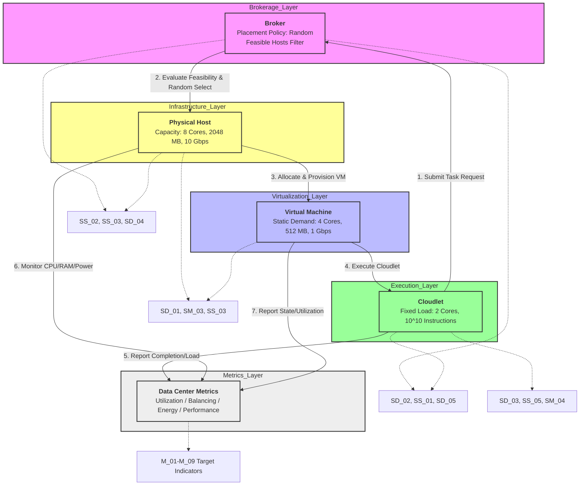

# JavaPhilosophy

Here will be a code analysis as you read the book "The philosophy of java"
Each chapter will be in separate directories, and there will also be combined directories by chapters if necessary

Here is the integrated conceptual model that unifies the three previous diagrams into a single cloud data center architecture, with explicit assumption mapping embedded in the diagram and detailed below.

### 🔹 Integrated Conceptual Model (Mermaid)

---

### 🔹 Conceptual Model Breakdown & Assumption Mapping

| Component | Role in Model | Linked Assumptions | Justification from Previous Tables |
|-----------|---------------|-------------------|-----------------------------------|
| **Broker** | Receives cloudlet requests, filters feasible hosts, applies uniform random selection, tracks placement success. | `SD_04`, `SS_02`, `M_09` | Uses random policy (`SD_04`) over hosts meeting hard feasibility constraints (`SS_02`). Tracks success rate against target `M_09`. |
| **VM** | Resource container bound to exactly one host. Executes cloudlets, reports utilization/state. | `SD_02`, `SS_01`, `SD_05`, `SM_05` | Fixed static demand (`SD_02`), one-to-one host mapping (`SS_01`), unchanging allocation (`SD_05`), deterministic steady-state (`SM_05`). |
| **Host** | Physical server providing compute/network resources. Tracks additive consumption and linear power draw. | `SD_01`, `SS_03`, `SM_03` | Fixed capacity limits (`SD_01`), additive resource usage (`SS_03`), linear power model (`SM_03`). |
| **Cloudlet** | Computational task with fixed instruction count and core requirement. Executes independently on VM. | `SD_03`, `SS_05`, `SM_04` | Fixed load (`SD_03`), execution time depends on allocated cores (`SS_05`), no inter-task sync (`SM_04`). |
| **Metrics Collector** | Aggregates host/VM/cloudlet data to compute utilization, load balancing, energy efficiency, and performance goals. | `M_01`–`M_09` | Maps raw telemetry to target thresholds (e.g., CV ≤ 0.15 for balancing, EPI ≤ 45 J/10⁹ instr for energy). |

---

### 🔹 Model Execution Flow (Step-by-Step)

1. **Task Submission**: A cloudlet (`SD_03`) submits a request to the Broker.
2. **Feasibility Filtering**: The Broker evaluates all 10 hosts against `SS_02` constraints (CPU ≥ 4, RAM ≥ 512, BW ≥ 1000). CPU is the binding constraint (max 2 VMs/host).
3. **Random Placement**: Among feasible hosts, the Broker applies `SD_04` (uniform random selection) to assign the VM.
4. **Provisioning**: The VM is bound to the selected host (`SS_01`). Resources are reserved additively (`SS_03`). Overhead is zero (`SM_02`).
5. **Execution**: The cloudlet runs on the VM. Execution time is calculated via `SS_05` (10¹⁰ instructions ÷ allocated throughput). Tasks run independently (`SM_04`).
6. **Monitoring & Metrics**: Hosts report load/power (`SM_03`), VMs report state/utilization, and cloudlets report completion times. The Metrics Collector computes `M_01`–`M_09` against target thresholds.
7. **Evaluation**: If load balancing (`M_04`) or energy efficiency (`M_06`) targets are violated, the model flags policy limitations (e.g., random placement causes clustering), though rebalancing is outside the current static scope.

---

### 🔹 Key Modeling Constraints & Implications

- **CPU is the Binding Constraint**: With 8 cores/host and 4-core VMs, each host can run exactly 2 VMs. RAM (2048 MB vs 512 MB demand) and BW (10 Gbps vs 1 Gbps demand) are non-binding under current assumptions.
- **Stochastic vs Deterministic**: Placement is stochastic (`SD_04`), but execution is deterministic (`SM_05`, `SM_02`). This creates a model where performance variability comes purely from placement clustering, not runtime fluctuations.
- **Metric Derivation**: 
  - `M_04` (Load Balancing CV) depends on how randomly placed VMs cluster CPU load across the 10 hosts.
  - `M_08` (Mean Completion Time) scales linearly with allocated cores (`SS_05`) and is unaffected by network/host latency (`SM_01`, `SM_02`).
  - `M_06` (Energy Efficiency) uses the linear power model (`SM_03`) applied to active hosts during task execution.

This conceptual model unifies the state transitions, resource flows, and policy logic into a single cohesive architecture, explicitly grounded in the `SD`, `SS`, `SM`, and `M` assumption framework. Let me know if you need the mathematical formulation of the `M` indicators or a simulation-ready pseudocode version.
