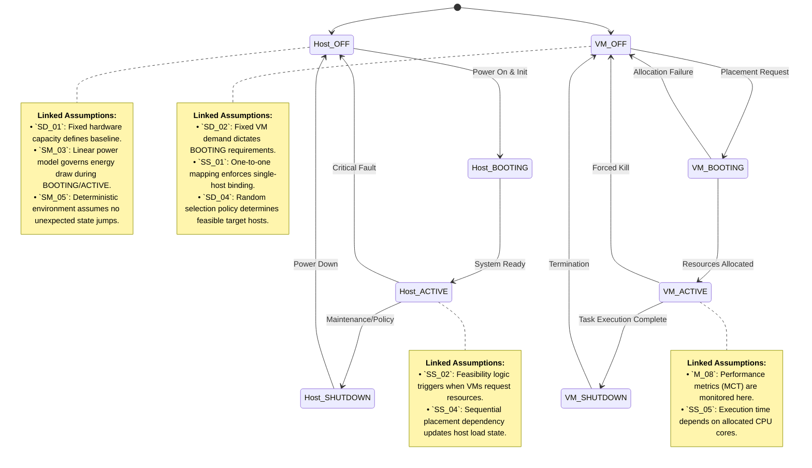

# JavaPhilosophy

Here will be a code analysis as you read the book "The philosophy of java"
Each chapter will be in separate directories, and there will also be combined directories by chapters if necessary

Here is the state transition diagram for both Physical Hosts and Virtual Machines, explicitly annotated with the relevant assumptions from the previous modeling framework.

### Key Mapping Notes:
- **`SD_01` & `SM_03`**: Define the physical baseline and energy consumption profile, directly impacting the `OFF ↔ BOOTING` and `ACTIVE` transitions.
- **`SS_02` & `SS_04`**: Govern the `Host_ACTIVE` state's capacity to accept new VMs and how sequential placement alters load distribution.
- **`SD_02` & `SS_01`**: Constrain the `VM_OFF → VM_BOOTING` transition, ensuring static resource demands and single-host binding are respected.
- **`SD_04`**: Drives the stochastic nature of the `VM_BOOTING` phase, where the broker randomly selects a feasible host from the shrinking pool.
- **`M_08` & `SS_05`**: Active in the `VM_ACTIVE` state, where task execution time and completion metrics are calculated based on allocated cores and instruction counts.
