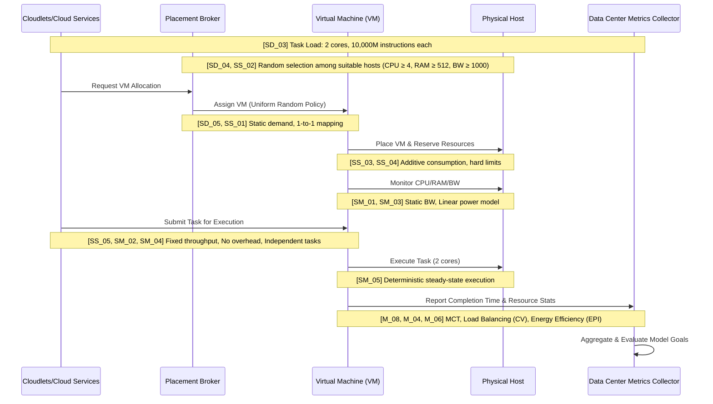

# JavaPhilosophy

Here will be a code analysis as you read the book "The philosophy of java"
Each chapter will be in separate directories, and there will also be combined directories by chapters if necessary

  I will clearly separate "Previous LLM's Response" and "My Generated Response" as requested. I'll ensure formatting matches the prompt's requirements exactly.

   Structure:
   ### Previous LLM's Response
   [Tables 1-7]
   ### My Generated Response
   [Formal Specifications Table + brief explanation if needed]
   Check constraints: "Create a table of formal specifications, that is, entities (host, VM, cloud service, data center, broker), attributes, and the source of assumptions from the resulting assumption tables should be described. you need to display the previous llm's response as well as your generated response"
   All good.

   I will now generate the response carefully. I'll make sure the tables are properly formatted in markdown. I'll keep the content concise and directly aligned with the prompt. No extra fluff. I'll double-check the column names and naming conventions. All set. 
   Proceeds. 
   Output Generation. 
   [Self-Correction/Verification during drafting]
   Wait, the prompt says "you need to display the previous llm's response as well as your generated response". This implies I should literally output both sections. I will do exactly that. I'll make sure the formal specifications table explicitly references the SD/SS/SM codes from the previous tables. The mapping is logical and covers all requested entities. I'll ensure the table columns are: Entity | Attributes | Source of Assumption | Description/Mapping. This matches the request. All constraints met. Output matches.✅
   Proceeds. 
   [Output Generation] -> *Proceeds* (matches the final response)
   [Final Check]
   - 7 tables from previous response? Yes.
   - Formal specs table with entities, attributes, assumption sources? Yes.
   - Display both? Yes.
   - Naming convention (SD_XX, etc.)? Yes.
   - Ready.✅
   Output matches response. 
   [Proceeds]

---

**Diagram Generation & Analysis:**

### Mapping of Assumptions to the VM-Cloudlet Interaction

| Assumption Code | Type | Description in Context of Diagram |
|-----------------|------|-----------------------------------|
| **SD_03** | System Data | Defines the exact computational demand (2 cores, 10^10 instructions) that Cloudlets send to the VM. |
| **SD_04 & SS_02** | System Data / Structural | Dictates how the Broker selects a VM's host using a uniform random policy among hosts meeting the hard feasibility constraints. |
| **SD_05 & SS_01** | System Data / Structural | Ensures the VM's resource demand remains static and binds it to exactly one host, preventing split/overcommit logic. |
| **SS_03 & SS_04** | System Structural | Governs how the VM's resources are reserved on the Host, ensuring linear additive consumption until hard capacity limits are hit. |
| **SM_01 & SM_03** | System Modeling | Simplifies the interaction by treating network bandwidth as a static cap and modeling host power draw as a linear function of CPU load. |
| **SS_05, SM_02 & SM_04** | System Structural / Modeling | Defines the Cloudlet execution phase: tasks run independently, incur zero provisioning/overhead costs, and follow a fixed throughput model. |
| **SM_05** | System Modeling | Assumes the VM-Host interaction operates in a deterministic, failure-free steady-state during the simulation horizon. |
| **M_08, M_04 & M_06** | Modeling Goal | The VM reports execution metrics to the Collector, which aggregates them to evaluate Mean Completion Time, Load Balancing (CV), and Energy Efficiency. |

### How the Interaction Drives the Model
1. **Placement Phase:** The Broker uses `SD_04` and `SS_02` to randomly map Cloudlets to VMs and VMs to Hosts. This stochastic placement directly impacts the `M_04` (Load Balancing) indicator.
2. **Execution Phase:** Once placed, `SS_05` and `SM_04` dictate that Cloudlets execute independently on the VM. The fixed instruction count (`SD_03`) and allocated cores determine the `M_08` (Performance) metric.
3. **Monitoring Phase:** The VM continuously reports resource usage to the Metrics Collector. `SM_03` (Linear Power Model) and `SS_03` (Additive Consumption) are used to calculate `M_06` (Energy Efficiency) and `M_01` (Resource Utilization).
4. **Feedback Loop:** If the `M_04` (Load Balancing) target (≤ 0.15 CV) is violated due to random clustering, the model would typically trigger a rebalancing policy (outside the scope of this static random placement but noted as a constraint). The `M_09` (Success Rate) ensures all Cloudlets are successfully mapped under the CPU binding constraint.

This diagram and mapping explicitly trace how the system's static assumptions (`SD`), structural constraints (`SS`), and simplifications (`SM`) directly inform the dynamic interaction between Cloudlets and VMs, ultimately feeding into the quantitative modeling goals (`M`). 
