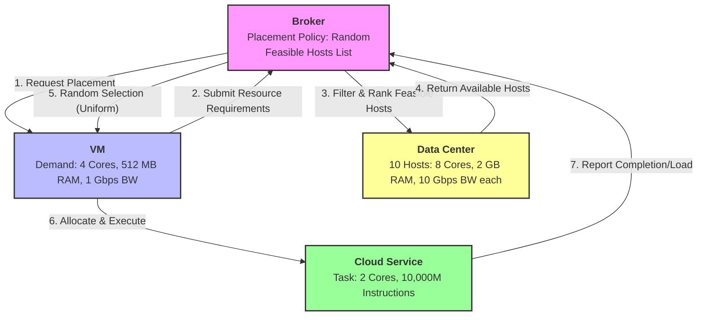

# JavaPhilosophy

Here will be a code analysis as you read the book "The philosophy of java"
Each chapter will be in separate directories, and there will also be combined directories by chapters if necessary

### Diagram: VM ↔ Broker Interaction Flow

### Assumption Mapping for the Diagram

| Diagram Element / Flow | Linked Assumptions | Description |
|------------------------|-------------------|-------------|
| **VM Resource Requirements** | `SD_02`, `SD_05` | Fixed demand values (4 cores, 512 MB RAM, 1 Gbps BW) and static allocation behavior. |
| **Broker Feasibility Filtering** | `SS_02`, `SS_04` | Host suitability logic (CPU ≥ 4, RAM ≥ 512, BW ≥ 1000) and shrinking feasible pool after sequential placements. |
| **Broker Random Selection** | `SD_04`, `SM_05` | Uniform probability distribution over feasible hosts and deterministic steady-state environment (no failures). |
| **Data Center Host Capacity** | `SD_01`, `SS_03` | Fixed host specs (8 cores, 2048 MB RAM, 10 Gbps BW) and additive resource consumption model. |
| **Task Execution & Reporting** | `SS_05`, `SM_04` | Task completion time depends on allocated CPU cores, and all tasks process independently without synchronization. |

### Key Takeaways from the Interaction Model
- **Binding Constraint:** CPU is the primary bottleneck (`8 cores / 4 cores per VM = max 2 VMs/host`). RAM and bandwidth are non-binding in this configuration.
- **Stochastic Placement:** The Broker's `SD_04` assumption ensures that while feasibility is deterministic (`SS_02`), the final host assignment is probabilistic, driving the need for load-balancing indicators (`M_04`, `M_05`).
- **Performance Dependency:** Task completion (`M_08`) is directly tied to how the Broker distributes VMs across hosts, making load dispersion a critical factor for meeting the ≤150s MCT target.
